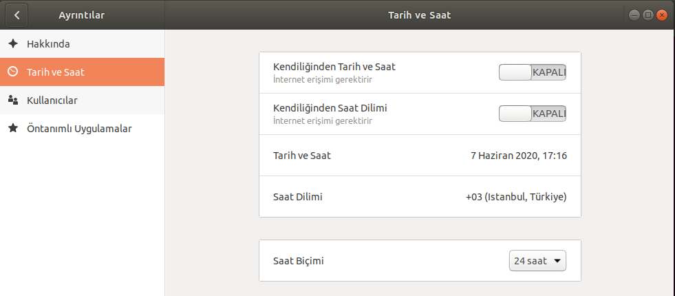

# Sistem Zamanın Güncellenmesi

### Server
Örnek çalıştırma şekli : 
```
sudo python3 server.py
```
Server çalıştırıldan sonra başka bir işlem yapılmasına gerek yoktur. Herhangi bir IP adresinden herhangi bir Porttan kendisine gelen zaman alma isteklerine karşın yanıt döndürmektedir. 

### Client
Örnek çalıştırma şekli : 
```
sudo python3 client.py --server IP_ADRESI
```
Çalıştırılması öncesi bir kaç işlem yapılması gerekmektedir. Bu işlemler aşağıda yer almaktadır.
Çalışma sırasında client tarafından server'a gönderilen zamanı alma istediği sırasında olabilecek herhangi bir gecikme hesabı katılmıştır. İşlem sırasında gerçekleşen gecikme hesaplanıp gelen sistem zamanından çıkartılıp o şekilde client zamanı güncellenmektedir.

**IP_ADRESI** kısmına, güncel zamanı milisaniye cinsinden ve zaman dilimini almak istediğiniz server'ın IP adresi olacak şekilde yazılmalıdır.

### Hatırlatmalar
- İki dosyada mutlaka sudo kullanılarak çalıştırılmalıdır.
- client.py dosyası parametre kullanılarak çalıştırılmalıdır.
- client tarafında zaman bilgisinin güncellenebilmesi için Tarih ve Saat ayarlarından "Kendiliğinden Tarih ve Saat" ayarını Kapalı olarak işaretleyin.


Serverdaki utc+3 utc-2 gibi işlemleri değişken üzerinden almaktadır. Eğer server'ın kendi default zaman dilimi değeri olması isteniyorsa **useDefaultTimeZone** değişkeni True olarak set edilmelidir.
Aksi durumda False olarak set edilirse, 
```
os.environ['TZ'] = 'Etc/GMT+7'
```
kısmı aşağıdaki listede yer alan verilere göre set edilmelidir.

```
Asia/Istanbul
Etc/GMT
Etc/GMT+0
Etc/GMT+1
Etc/GMT+10
Etc/GMT+11
Etc/GMT+12
Etc/GMT+2
Etc/GMT+3
Etc/GMT+4
Etc/GMT+5
Etc/GMT+6
Etc/GMT+7
Etc/GMT+8
Etc/GMT+9
Etc/GMT-0
Etc/GMT-1
Etc/GMT-10
Etc/GMT-11
Etc/GMT-12
Etc/GMT-13
Etc/GMT-14
Etc/GMT-2
Etc/GMT-3
Etc/GMT-4
Etc/GMT-5
Etc/GMT-6
Etc/GMT-7
Etc/GMT-8
Etc/GMT-9
Etc/GMT0
Etc/Greenwich
Etc/UCT
Etc/UTC
Europe/Istanbul
Turkey
```
